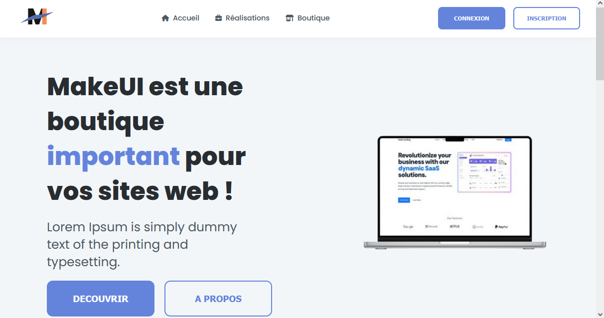
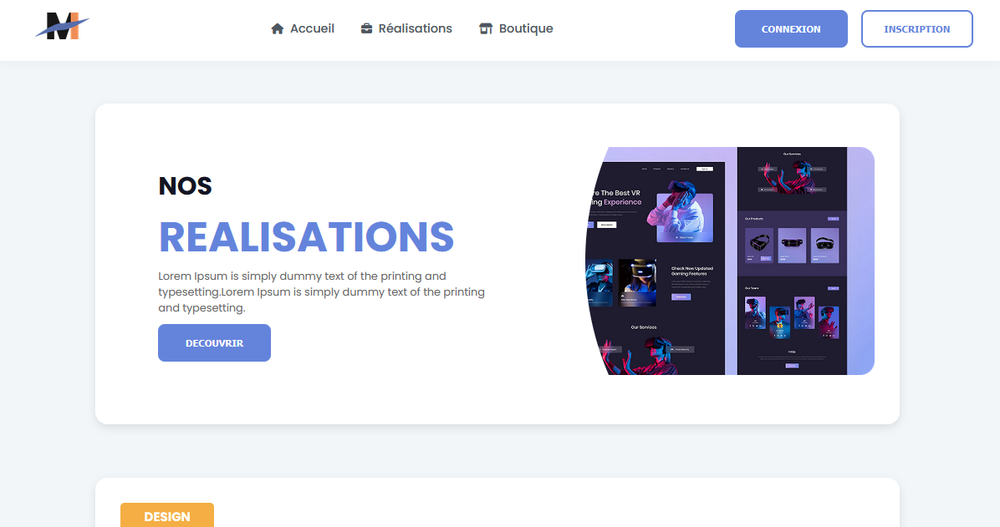
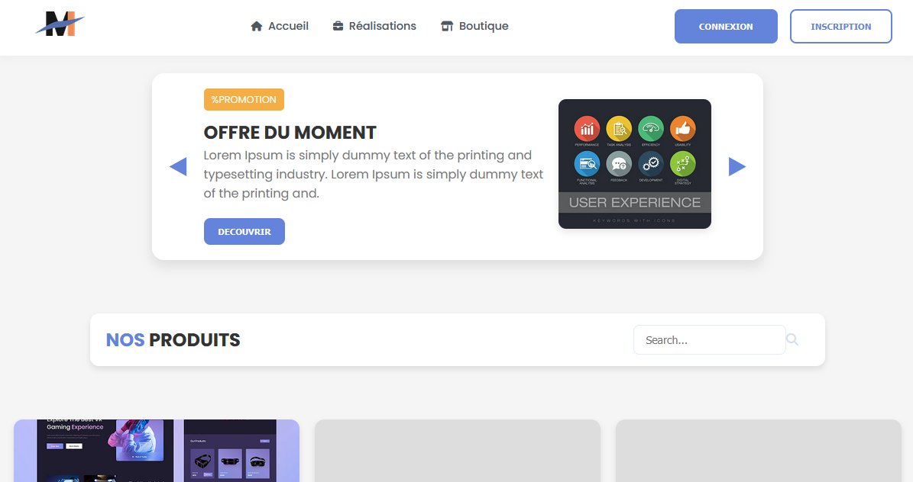

# MakeUI

## Introduction
Ce faux site vitrine à été l'un de nos projets de première année. Il ne fonctionne pas entièrement, le but était simplement de jouer avec Html, Css.

## Lancer le site

Vous pouvez retrouver le site en ligne (depuis GitHub directement).

[➜ Découvrir en ligne !](https://htmlpreview.github.io/?https://raw.githubusercontent.com/IdNewaill/MakeUI/refs/heads/main/public/index.html)

Pour ouvrir en local, le index.html se trouve ici :

[➜ Découvrir en local](./public/index.html)

## Apperçu

### Page - Nos réalisations
Cette page contient quelques informations (avec beaucoup de Lorem Ipsum)

### Page - Boutique

Cette page n'a pas été remplie entièrement mais représente bien le design de ce qu'on avait souhaité faire.

